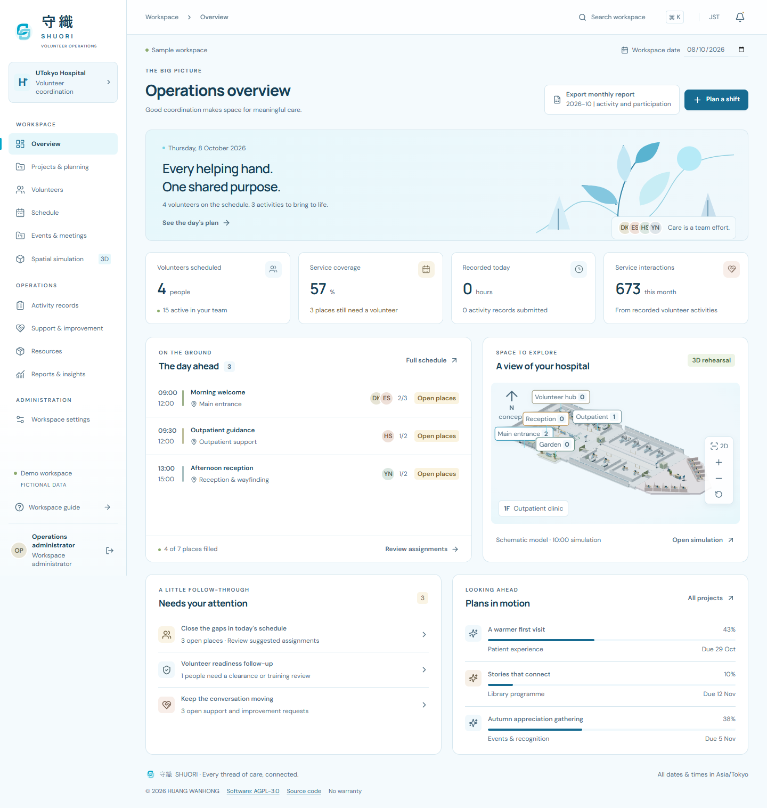
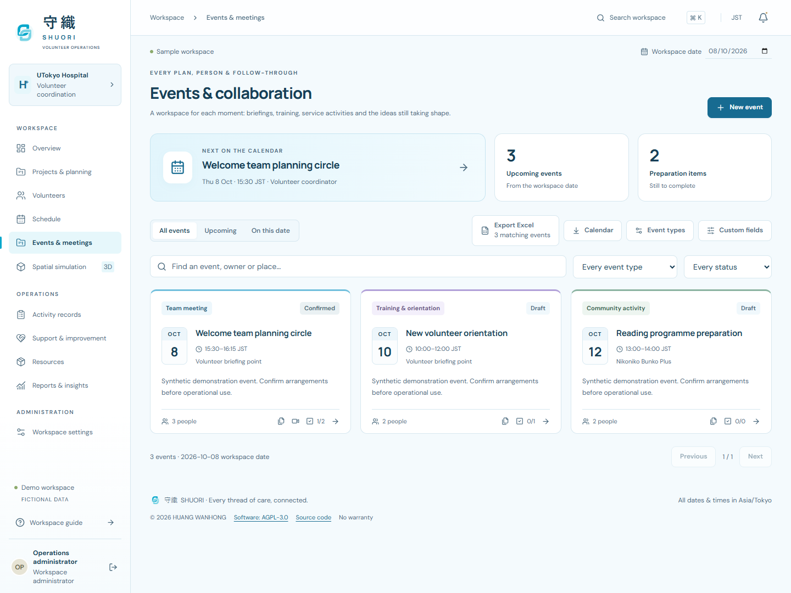
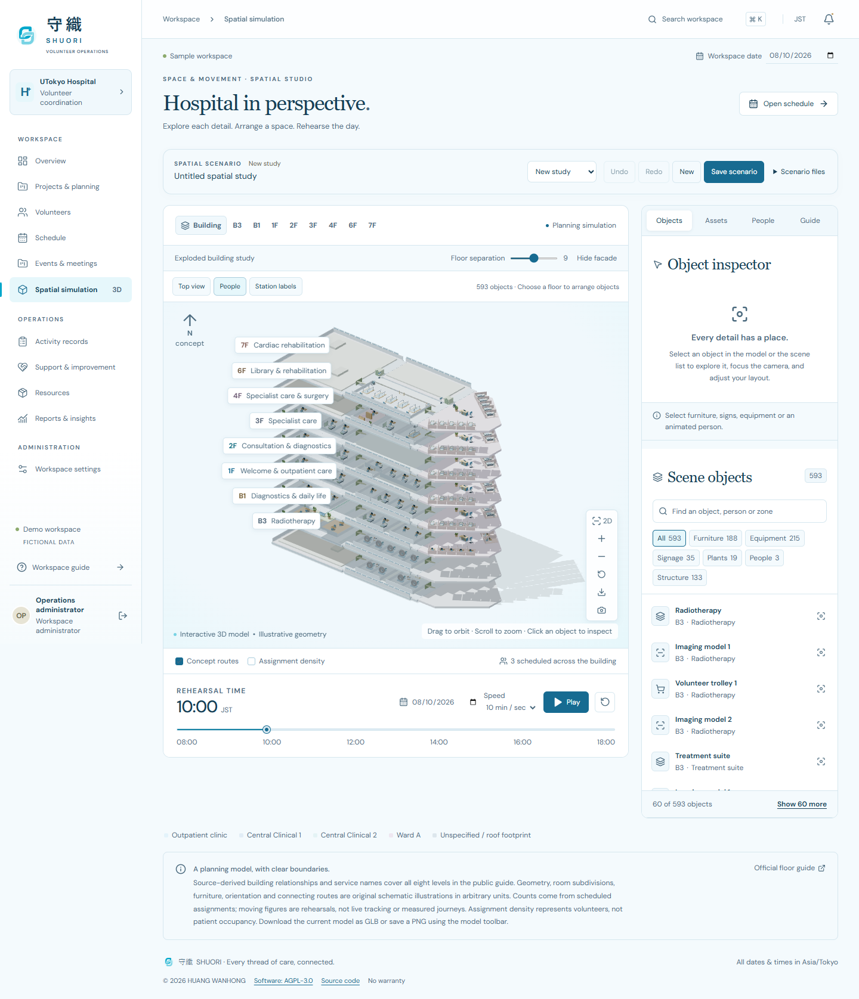

# 守織 SHUORI · Volunteer Operations

<p></p>

[Documentation](docs/README.md) · [Events and records](docs/EVENTS-AND-RECORDS.md) · [Excel guide](docs/EXCEL-EXPORTS.md) · [Spatial Studio](docs/SPATIAL-STUDIO.md) · [Licensing](docs/LICENSING.md) · [Contributing](CONTRIBUTING.md)

A complete English-language workspace for hospital volunteer coordination, built around the responsibilities in [`meta/JOB-BACKGROUND.md`](meta/JOB-BACKGROUND.md).

守織 SHUORI connects people, projects, service shifts, activity records and hospital space. Version **1.3** adds modular event workspaces, custom event types, richer volunteer profiles, configurable typed fields, dated volunteer records, authenticated report uploads and shared-folder links. Meetings can connect to saved Zoom, Google Meet or Teams links; attendance, preparation checklists, event relationships and Excel exports remain with the event. It builds on the 守織 SHUORI identity, hospital-inspired aqua palette and formatted Excel workbooks for administrative reporting. Spatial Studio provides a detailed, editable 3D environment with independently modeled furnishings, selectable volunteer figures, object inspection, saved layouts and drawn rehearsal routes. It includes a persistent API, role-based accounts, scheduling rules, critical-path analysis, and an interactive model of all eight levels published in the hospital's public floor guide.



## Open the application

Download the [packaged SHUORI 1.3.0 application](artifacts/releases/shuori-1.3.0.zip) ([SHA-256](artifacts/releases/shuori-1.3.0.sha256)) for source, compiled assets, models and examples, or clone the repository below. Node.js is required for either route.

Clone this repository first:

```bash
git clone https://github.com/wwwwanhonghuang/Hospital-Volunteer-Activity-Management.git
cd Hospital-Volunteer-Activity-Management
```

Requires **Node.js 22.13+** and a current browser. Google Chrome is used by the browser test suite. Windows users can run `Start-SHUORI.cmd`, or use:

```powershell
npm.cmd ci
npm.cmd run build
npm.cmd start
```

Open **http://127.0.0.1:3001** and choose **Explore demo workspace**. The demo is fully editable, uses fictional data, and saves changes to `data/demo.sqlite`. On macOS/Linux, use `npm` instead of `npm.cmd`.

For development, `npm.cmd run dev` starts the interface at **http://127.0.0.1:5173** and the API at port 3001. Stop an existing API server before starting development.

Production mode has a separate empty database and requires a real administrator password. See the [deployment guide](docs/DEPLOYMENT.md) for HTTPS, accounts, service operation, backups and restoration. Production does not expose demo sign-in.

## What is implemented

| Workspace | Working capabilities |
| --- | --- |
| Overview | Selected-day staffing, coverage, recorded hours, monthly service interactions, upcoming activities, project progress, actionable follow-ups |
| Projects & planning | Project briefs, ownership, goals, risks, budget/spend, task board, dependent tasks, Gantt view, calculated critical path and float, editable duration scenarios |
| Volunteers | Recruitment-to-active lifecycle, searchable profiles, skills/languages, weekly availability, workload caps, training, administrative health readiness, individual activity history, emergency contacts, tags, typed custom fields, dated follow-up records and profile attachments |
| Schedule | Daily activity/volunteer timelines, weekly board, station coverage, manual assignments, eligibility explanations, reviewed allocation suggestions, calendar export |
| Events & meetings | Custom event types, multi-day events, participant/project/shift/resource links, optional meeting/checklist/attendance modules, reports and shared folders, calendar and Excel export |
| Spatial Studio | Eight public levels, detailed interiors, 15 asset types, selectable objects and people, search/filter/inspector, move/rotate controls, numeric transforms, undo/redo, saved scenarios, route drawing for assignments, time/speed controls, density overlay, 2D fallback, GLB/PNG/scene JSON export |
| Activity records | Actual hours and service counts, shift/volunteer references, validation, corrections, custom fields, linked events, supporting files and filtered Excel and CSV |
| Support & improvement | Consultation, service improvements, incident follow-up and department coordination; priorities, owners, due dates and recorded resolutions |
| Resources | Station inventory, available quantity, inspections and maintenance |
| Reports & insights | Month selection, service/hours trends, category breakdown, participation summaries, recognition candidates, monthly Excel workbooks, CSV and print layout |
| Workspace settings | Administrator/coordinator/viewer accounts, audit history, Excel/CSV collection exports, complete workspace and readiness workbooks, administrator backup, source and operating assumptions |

All ordinary create/edit actions are stored in SQLite. Concurrent edits are checked using record versions. A failed validation cannot partly save a proposed schedule. Demo mode persists across restarts; it is not browser-only storage.

## Excel reporting

Use **Export Excel** on a list to download every matching record across all pages. Schedule exports follow the selected day or week; project workbooks include task dependencies and calculated critical-path values. **Monthly report Excel** includes totals, participation, recognition planning, service categories and a six-month trend. **Workspace settings** provides whole-collection, complete-workspace and administrative-readiness workbooks.

The files contain separate named worksheets, frozen headings, filters, readable references and native numeric/date cells. Japanese text and phone-number leading zeros are preserved. Workbooks are snapshots of saved data; editing them does not change the application. See the [Excel guide](docs/EXCEL-EXPORTS.md) for contents and scope.

Five fictional-data examples are included: [event workspace](artifacts/exports/shuori-demo-events.xlsx), [monthly report](artifacts/exports/shuori-demo-monthly-report.xlsx), [project plan](artifacts/exports/shuori-demo-project-plan.xlsx), [readiness](artifacts/exports/shuori-demo-readiness.xlsx) and [complete workspace](artifacts/exports/shuori-demo-workspace.xlsx). The [identity guide](docs/BRAND.md) documents the original logo, hospital color reference and compatibility with earlier releases.

## Flexible records and connected events



Open **Volunteers > Customize records** or **Workspace settings > Record fields** to define text, long-text, number, date, choice-list and yes/no fields for profiles, events, service activity or dated volunteer records. Archive fields to preserve their existing values. Volunteer records provide a separate dated history for training, qualifications, recognition, conversations and follow-ups without changing service-hour totals.

Create a type in **Events & meetings**, then enable meeting, preparation checklist and attendance modules for each event. Link projects, service shifts, resources and participants. The Schedule shows events alongside staffed shifts. Event overlap warnings are advisory; service-shift allocation and reported service hours remain governed by the roster and activity records.

Every event, shift, volunteer profile and record can hold authenticated uploads or external document/folder links. Coordinators and administrators can upload/remove files; viewers can download. Uploads are stored atomically with their metadata in SQLite, capped at 10 MiB per file and 250 MiB per workspace, and included in portable backups. File checking verifies supported document signatures; it is not a malware scanner.

Google Drive and other cloud folders work through existing HTTPS sharing links. The external provider retains its permissions; SHUORI does not create Zoom meetings, authenticate to Google, synchronize folders or provision Cloud Storage. See the [events and records guide](docs/EVENTS-AND-RECORDS.md) for the complete workflow and boundaries.

## Explore the model



The spatial page reconstructs the **published guide levels B3, B1, 1F, 2F, 3F, 4F, 6F and 7F** across the outpatient clinic, Central Clinical Buildings 1 and 2, and Ward A. Each level has source-derived service zones with original schematic partitions and furnishings. Use **Building** for the exploded stack and a floor button for a closer view.

The model is **not a surveyed BIM model**. Public diagrams do not provide sufficient dimensions, elevations or complete internal geometry. Shapes, distances, furniture, floor separation and routes are illustrative. B2 and 5F are absent from the supplied public guide and are explicitly omitted. The model does not claim to reconstruct unpublished wards or the complete hospital campus.

Click a furnishing or volunteer to inspect it; double-click to focus. On a single floor, coordinators can move or rotate assets, add equipment and signage, hide or reset items, and save arrangements as named scenarios. Drag controls snap to 0.25 scene units and 15 degrees; numeric fields support precise edits. Forty undo steps and redo support layout exploration. The structure remains a fixed reference. See the [Spatial Studio guide](docs/SPATIAL-STUDIO.md) for editing, route drawing, JSON transfer and persistence.

Counts and movement come from scheduled volunteer assignments. Drawn routes link to a specific assigned volunteer and shift on the same floor. Playback uses an arbitrary 24 simulation-minute round trip, with no collision detection or automatic pathfinding. Saving a scene changes its spatial study without changing the real schedule. The [source register](docs/FLOOR-SOURCES.md) records which information was verified and which geometry was created for this application.

Export the visible model using **Download 3D model** in the scene toolbar. A prepared building GLB and preview images are included under [`artifacts/`](artifacts/).

## Scheduling and project calculations

- Eligibility requires an active volunteer, completed training, current administrative clearance, matching skills, declared weekday/time availability, an acceptable weekly workload, and no overlapping assignment. Different stations require a configurable-in-code 10-minute planning buffer.
- The allocator keeps existing assignments, fills scarce shifts first, and favours lower proportional weekly loads. It is a deterministic heuristic. A coordinator reviews its proposal before an atomic save; it does not claim a global optimum.
- The critical-path engine performs forward and backward passes on finish-to-start task dependencies. It calculates earliest/latest starts and finishes, float and zero-float tasks. Cycles and invalid dependencies are rejected.
- Project durations are **calendar days**, including weekends. Project dates do not incorporate a hospital holiday calendar or resource levelling. The what-if tool previews the effect of a changed duration and explicitly saves it only when applied.
- All operational dates and times are interpreted in **Asia/Tokyo**. Activity records measure individual participation and service interactions; interactions are not unique visitors.

## Verify the release

```powershell
npm.cmd run build
npm.cmd test
npm.cmd run test:e2e
```

The browser tests launch an isolated seeded database and use the installed Chrome browser. They do not modify the normal demo or production database. If Chrome is unavailable, install Playwright Chromium with `npx.cmd playwright install chromium` and remove `channel: 'chrome'` from `playwright.config.ts`.

Read the [verification record](docs/VERIFICATION.md) for the actual checks performed in this workspace. The source, compiled assets, standalone model and documentation are packaged by `node scripts/package-release.mjs` into `artifacts/releases/` with a SHA-256 manifest. The package excludes databases, credentials, dependency installations and temporary tests.

## Technical structure

```text
src/                   React + TypeScript application and Three.js model
content/spatial/       Separately licensed model descriptions and asset data
server/                Express API, SQLite, session security and validation
shared/                Scheduling, critical-path algorithms and scenario validation
tests/                 API/domain tests and browser acceptance tests
scripts/               Development, backup/restore, QA and release packaging
docs/                  Design, architecture, deployment, sources, verification
artifacts/             Preview images, standalone model, QA evidence, release ZIP
meta/JOB-BACKGROUND.md  Original task background, preserved unchanged
```

The frontend is built with React, TypeScript and Vite, with Three.js for 3D. The backend uses Express and Node's built-in SQLite driver. Fonts are bundled, and the application makes no external font, analytics or map requests. See [architecture](docs/ARCHITECTURE.md) and [product design](docs/PRODUCT-DESIGN.md).

This is an independent implementation of the supplied job brief, not an official hospital product. It is prepared for local evaluation and controlled deployment. Institutional acceptance, actual operating procedures, verified building data and environment-specific security review remain deployment responsibilities.

## License and attribution

Copyright © 2026 **HUANG WANHONG** ([wwwwanhonghuang](https://github.com/wwwwanhonghuang)) and contributors, for their respective original contributions.

SHUORI uses **separate licenses for software and creative material**:

| Material | License |
| --- | --- |
| Original application, API, rendering code, scripts, tests and build configuration | **[AGPL-3.0-only](LICENSE)** |
| Original model descriptions in `content/spatial/`, SHUORI SVG artwork, standalone models, preview artwork, documentation and authored example content | **[CC BY-NC-SA 4.0](LICENSES/CC-BY-NC-SA-4.0.txt)** |
| Third-party libraries, icons, fonts and external reference material | Their existing terms |

**Commercial use of the software is permitted by the AGPL.** Its copyleft and source-access obligations apply, including the offer of Corresponding Source to users of modified network versions. The separately licensed creative assets require noncommercial use, attribution and ShareAlike; using the supplied application with those assets must also respect their terms. You may replace or remove the assets when making a software adaptation.

These are file-scoped licenses, not a choice between AGPL and CC for the same material. See the [path map](LICENSES/README.md), [licensing guide](docs/LICENSING.md), [NOTICE](NOTICE) and [third-party notices](docs/THIRD-PARTY-NOTICES.md). Hospital/job-description material and later operator-entered records are outside the project's original-material licensing claim.
