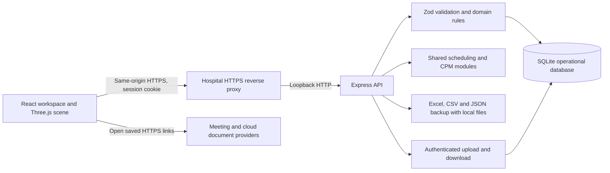

# 守織 SHUORI architecture

守織 SHUORI is an English-language, general-purpose hospital volunteer operations workspace developed independently as a personal project. It supports recruitment and orientation, volunteer support and administrative clearance reminders, visitor guidance, library support, event planning, activity reporting, recognition, service improvement and departmental coordination. It is not affiliated with, commissioned by or endorsed by any particular hospital, university or organization.

## Runtime and boundaries

The application is a React 19 and TypeScript single-page interface. Vite builds the interface into `dist/`; Express 5 serves those assets and the `/api` endpoints from one origin. Three.js renders the interactive hospital planning scene in the browser. Node.js 22 provides SQLite through its built-in `node:sqlite` module, so no separate database service is required.

The supported deployment is one application process on one host with a persistent local database. The demo uses synthetic profiles and records. Production starts with empty operational collections and an initial administrator account. Database metadata prevents opening a demo database as production or the reverse.

## Repository map

| Path | Responsibility |
| --- | --- |
| `src/types.ts` | Shared application data contract |
| `src/api.ts` | Browser API client and CSRF header handling |
| `src/pages/` | Operational screens |
| `src/components/HospitalScene.tsx` | Spatial planning visualization |
| `src/components/hospitalModel.ts` | Generic loader for eight-floor declarative geometry and stable scene object registry |
| `src/components/spatialAssets.ts` | Generic assembly loader for furniture, equipment, signs and articulated volunteer figures |
| `src/components/spatialTypes.ts` | Scene object metadata and the 15-kind asset catalog |
| `src/components/spatialInteraction.ts` | Picking, focus, transform controls, scene overrides and route drawing |
| `src/components/SpatialStudioPanel.tsx` | Searchable object browser, inspector and asset palette |
| `src/components/useSceneScenario.ts` | Scenario drafts, undo/redo, server persistence and JSON transfer |
| `shared/scheduling.mjs` | Eligibility, weekly workload and allocation suggestions |
| `shared/cpm.mjs` | Critical-path calculation |
| `shared/spatial-scenario.mjs` | Scenario schemas, capacity limits and operational route references |
| `server/app.mjs` | API, authentication, persistence and exports |
| `server/attachments.mjs` | Validated file upload, authenticated download, storage limits and external document links |
| `server/backup.mjs` | Shared atomic operational/blob backup and restore implementation |
| `src/components/CustomFields.tsx` | Typed custom-field rendering and definition management |
| `src/components/AttachmentPanel.tsx` | Per-record files and external links |
| `src/components/JournalPanel.tsx` | Dated volunteer history and follow-up records |
| `content/spatial/*.json` | Independently licensed declarative building, furnishing and catalog content |
| `src/components/loadSpatialContent.ts` | Cached loading of separate content resources without executing data |
| `server/excel-export.mjs` | Typed Excel workbooks, scope validation, reporting and export limits |
| `server/validation.mjs` | Field schemas and cross-record constraints |
| `server/seed.mjs` | Synthetic demonstration data and location metadata |
| `scripts/backup.mjs` | Operational JSON backup and safe restore |
| `tests/api.test.mjs` | Real HTTP and SQLite integration tests |
| `tests/domain.test.mjs` | Scheduling and project-network tests |
| `tests/event-records.test.mjs` | Event references, custom-field rules, file permissions, upload validation and blob recovery |
| `tests/excel-export.test.mjs` | Typed workbook read-back, exact scope, event child tables and file references |
| `tests/spatial-scenario.test.mjs` | Scenario geometry, authorization, persistence, reference integrity and backup compatibility |

## Data model

| Collection | Purpose and relationships |
| --- | --- |
| Volunteers | Contact details and preference, address, emergency contact, tags, programme status, skills, languages, availability, training completion, administrative clearance, weekly hour cap and custom fields |
| Projects | Purpose, ownership, department, dates, budget, spending, outcomes and risks |
| Tasks | Project-owned work items, duration, predecessors, owner, status and progress |
| Shifts | Date, hours, service location, requirements, assignments and optional project |
| Activity records | One record per assigned volunteer and shift, with actual hours, aggregate service count, optional event link and custom fields |
| Events | Single- or multi-day schedule, type, owner, venue, project, volunteers, shift/resource references, modules, meeting details, checklist, attendance and custom fields |
| Event types | Custom classification, display color, active state and default meeting/checklist/attendance modules |
| Field definitions | Scoped labels, stable IDs, types, options, required/active flags and display order for volunteers, events, activity records and journal entries |
| Journal entries | Volunteer-owned dated record, category, status, follow-up date, body, optional event and custom fields |
| Attachments | Metadata for a local file or HTTPS link belonging to an event, volunteer, shift, activity record or journal entry |
| Requests | Consultation, improvement, incident and coordination follow-up |
| Resources | Inventory, available quantity, location, inspection date and maintenance status |
| Scenarios | Named spatial studies with object overrides, added assets and routes linked to a volunteer/shift pair |
| Locations | Named stations and documented or conceptual floor/building metadata |
| Audit | Actor, action, entity reference, timestamp and short operational summary |

Operational records have a stable ID and integer version. Updates and deletions require the version last read by the client. A stale version returns HTTP 409; the coordinator refreshes before retrying. Creation, updates, deletion and schedule application write the entity and audit entry in the same SQLite transaction. Deleting an entity still referenced by another record is refused.

SQLite uses write-ahead logging, foreign keys for account/session relationships, parameterized statements and a five-second busy timeout. Operational entities are validated JSON documents stored under a collection/ID primary key. Cross-record relationships are enforced by the application inside write transactions. `attachment_blobs` stores raw file bytes by attachment ID; upload/removal commits metadata, bytes and audit together.

The database and backup schema version remains 1. Startup creates the new blob table with `CREATE TABLE IF NOT EXISTS`; event and record collections use the existing entity table. Parsing supplies defaults for new optional profile and activity fields, so prior records remain usable. Existing workspaces are not reseeded. There is no general migration framework. Older schema 1 backups that predate scenarios or the new collections restore with those collections empty. File-bearing backups additionally carry an `attachmentBlobs` array of attachment IDs and base64 data. Recovery rejects missing, duplicate, orphan or altered blobs and validates file limits before committing the complete import.

The ordinary state response includes the latest 1,000 audit entries. JSON backups contain the complete audit history. Audit entries have no edit/delete API, but database administrators with filesystem access remain able to alter the database. This is an operational audit trail, not a tamper-evident compliance ledger.

## Flexible fields, events and record history

Custom values are scalar strings, finite numbers, Booleans or null, keyed by field-definition ID. Validation enforces the definition's scope and type, selected options and required active fields. Zero and `false` count as recorded values. Existing values prevent changing a field's scope/type or deleting the definition; used select options must remain. Archiving retains history and stops a field from being required on later edits. There are at most 100 custom values per record, with text values bounded to 4,000 characters.

Event types define defaults; each event saves its own chosen modules. Events permit multi-day durations and require the combined end date/time to follow the start. All references must exist. Attendance entries must identify unique volunteers already present in the event participant list. Checklists and attendance each permit up to 100 entries. Journal entries always reference a volunteer and may reference an event. They track follow-up and history independently of the actual service-hour ledger.

Meeting URLs are saved HTTPS addresses; the browser opens the chosen provider. Resource and shift links are explicit planning relationships, not inventory reservations or automatic assignment changes. Event attendance does not create activity hours. The event planner and the operational shift allocator retain distinct responsibilities. See [Events and records](EVENTS-AND-RECORDS.md) for workflows and permission boundaries.

## File storage and external services

All parent records use the same attachment service. Metadata appears in the authenticated state response, while bytes are only available through the authenticated download endpoint. Uploads use raw `application/octet-stream` bodies, avoiding base64 expansion in ordinary upload requests. The server permits non-empty PDF, Office, UTF-8 text/CSV and supported image files, checks filenames and basic signatures, computes SHA-256 itself, and applies limits of 10 MiB per file, 250 MiB total file bytes and 200 attachments per parent. These are application constants, reported by `/api/storage`.

Downloads use an attachment disposition, `application/octet-stream`, no-store caching, no-sniff headers and a restrictive sandbox content-security policy. The service does not render uploaded HTML or execute file contents. File signature checks are not malware scanning or full document validation. Concurrent uploads recheck capacity inside the write transaction. Deleting a parent with attachments is refused until its attachments are removed; deleting an attachment removes metadata and bytes together.

External attachments store an HTTPS address without embedded username/password credentials. The server does not retrieve it. Google Drive, SharePoint and other providers continue to control file permissions. Meetings similarly use existing Zoom, Google Meet, Teams or other HTTPS join URLs. There is no provider OAuth, cloud bucket storage, automatic document synchronization, meeting provisioning or recording import. No external provider credentials are required for the local upload and saved-link implementation.

## Scheduling rules

Eligibility is evaluated for a particular volunteer and shift. All of the following are required:

1. Programme status is active and training is complete.
2. Administrative health clearance is marked cleared and remains valid through the shift date, inclusive.
3. The volunteer is available on the shift weekday and throughout its hours.
4. Every required skill appears on the volunteer profile.
5. The volunteer has no overlapping assignment. Different locations require a ten-minute transfer gap; adjacent shifts at the same location may meet exactly.
6. Planned plus recorded hours remain within the volunteer's weekly cap. A week starts on Monday. Actual records replace the corresponding planned hours instead of being added twice.

Calendar dates are interpreted as civil dates, with Tokyo used for today's date. Overnight shifts are not supported; split them at the date boundary. The ten-minute transfer gap is a configurable-code planning assumption, not a measured journey through the hospital. Location opening hours and capacity figures are informational; they are not hard eligibility constraints. Coordinators must confirm service availability and station limits with hospital staff.

Suggestions fill open positions using a deterministic greedy algorithm: shifts with the fewest eligible candidates are considered first, then candidates with the lowest allocated proportion of their weekly allowance. Name ordering resolves ties. Existing assignments are preserved. This is a decision aid and does not guarantee a globally optimal allocation.

A proposal is read-only until a coordinator applies it. The apply endpoint rechecks every version and validates all proposed assignments against the resulting complete schedule in one transaction. A stale version, readiness failure, overlap or workload violation rejects the whole batch.

Changing a volunteer's training, clearance, availability or programme status succeeds immediately, even when existing assignments become invalid. This permits timely recording of a changed situation. Those assignments remain visible and are flagged by eligibility checks and suggestion explanations. Saving an affected shift or applying a proposal containing that shift requires correcting its assignments. Unrelated records remain editable. Completed historical shifts are preserved as history; a future shift cannot be marked completed.

## Project engineering

Critical-path analysis runs a forward pass for earliest start/finish and a backward pass for latest start/finish. Slack is the difference between latest and earliest start. All zero-slack tasks are marked critical; the returned `criticalPath` identifies one connected longest path when multiple critical branches exist.

Durations are integer calendar days, with project start as day zero. Weekends and holidays are included. The diagram is a planned dependency calculation; percent-complete values do not automatically recompute remaining duration. Missing predecessors, dependency cycles, duplicate IDs and dependencies crossing project boundaries are rejected. Budget values are planning inputs and are not an accounting ledger.

## Spatial provenance

The visualization is a schematic planning model. Floors, stations, geometry, paths, furnishings, camera orientation and moving volunteer figures are illustrative unless a specific field explicitly cites an official source. The animation follows scheduled assignments; it does not consume live tracking, patient occupancy or physical access-control data. Station capacity is a planning hint.

The bundled demo uses an original illustrative reconstruction of an external source hospital's public floor guide. The [source register](FLOOR-SOURCES.md) preserves the official references and distinguishes published information from invented geometry. Demo station names and schedules are examples; their presence does not describe current services, an approved deployment or organizational affiliation. Replace and validate operational location data for the deploying organization. The example model is unsuitable for evacuation, clinical routing or accessibility certification.

## Spatial Studio state and interaction

The model data assigns stable IDs and descriptive metadata to independently selectable assets. Building and furnishing geometry is stored as separate non-executable JSON resources under `content/spatial/`, with generic AGPL loaders. Vite emits those assets separately with inlining disabled; cached requests and shared geometry/material templates preserve reuse. The original creative model data carries CC BY-NC-SA 4.0 metadata, independently of the software license. Geometry components are grouped into furnishings and equipment; the editor transforms a whole asset. Architectural geometry remains fixed. Screen information cards project a selected object's position into the viewport. A searchable object list provides selection and focus without requiring precise pointer picking.

Scenario content is separate from the generated reference geometry. `objects` maps stable IDs to floor-local X/Y/Z positions, Y-axis rotation and visibility overrides. `additions` contains typed assets with an ID, name, floor and initial transform. `routes` contains a route ID, volunteer ID, shift ID, floor and X/Z waypoint sequence. Exploded-floor presentation applies only a parent display offset. Unmodified objects retain their generated transforms.

The interaction layer applies scenario overrides to the scene, picks visible objects with a raycaster and attaches Three.js transform controls to editable assets. Pointer translation snaps to 0.25 scene units; rotation snaps to π/12. Numeric inspector fields expose position and rotation. The client maintains up to 40 prior editing states, redo history, a temporary account-scoped session draft and explicit server save. Scene JSON import creates an unsaved copy; it does not change database identifiers or create missing operational records.

`shared/spatial-scenario.mjs` validates both shape and route references. Supported floors are B3, B1, 1F, 2F, 3F, 4F, 6F and 7F. Limits are 2,000 object overrides, 300 additions, 100 routes and 2–50 waypoints per route. Coordinates are bounded to X ±45, Z ±22 and Y 0–6, with rotation ±2π; finite values, safe identifiers and supported asset kinds are required. Object overrides refer to the client model's stable IDs; the backend does not maintain the generated object registry or validate the existence of those geometry IDs.

Every route references an existing volunteer assigned to an existing shift, on that shift location's floor. Only one route per volunteer/shift pair is allowed within a scenario. Historical and archived assignments remain valid for rehearsal. Deleting a referenced person or shift, removing the assignment, or changing its floor is refused until the linked routes are updated or removed. Batch schedule application includes this check in its transaction. Scenario edits never modify the roster or inventory.

Active figures interpolate along a custom route or an illustrative default station route. The period is an arbitrary 24 simulation-minute round trip with a deterministic volunteer offset. There is no collision engine, shortest-path solver or cross-floor route simulation. GLB export serializes visible structural geometry and scenario furnishings, while scenario JSON retains editable spatial intent; operational data and route animation are outside the static GLB. See [Spatial Studio](SPATIAL-STUDIO.md) for the user workflow.

## Authentication and API

| Endpoint | Behaviour |
| --- | --- |
| `GET /api/health` | Public process status, mode and version |
| `GET /api/session` | Current account and CSRF token, or a signed-out result |
| `POST /api/login` | Password sign-in |
| `POST /api/demo-login` | Demo-only sign-in as admin, coordinator or viewer |
| `POST /api/logout` | End the current session |
| `GET /api/state` | Authenticated operational state |
| `POST /api/:collection` | Coordinator/admin creation; attachment writes use dedicated endpoints |
| `PUT /api/:collection/:id` | Coordinator/admin update with version; attachments have no generic update endpoint |
| `DELETE /api/:collection/:id` | Coordinator/admin deletion with version; attachment deletion also removes its blob |
| `POST /api/schedule/suggest` | Coordinator/admin proposal for a date |
| `POST /api/schedule/apply` | Coordinator/admin atomic proposal application |
| `GET /api/export/:collection.csv` | Authenticated CSV export |
| `POST /api/export/xlsx` | Authenticated, CSRF-protected Excel snapshot export; viewers allowed |
| `GET /api/storage` | Authenticated storage usage, provider and upload limits |
| `POST /api/attachments/upload` | Coordinator/admin raw file upload; query parameters identify target, filename and optional description |
| `POST /api/attachments/link` | Coordinator/admin creation of an external HTTPS link |
| `GET /api/attachments/:id/download` | Authenticated local file download; external links are opened at their provider |
| `DELETE /api/attachments/:id` | Coordinator/admin atomic metadata/blob deletion with version |
| `GET /api/backup` | Administrator-only JSON backup including local file bytes |
| `GET /api/users` | Administrator-only account list |
| `POST /api/users` | Administrator-only account creation |
| `PUT /api/users/:id` | Administrator-only name, role or password change |

Viewers can read operational data, event meeting details and attachment metadata, download local files and export Excel/CSV. Coordinators can manage operational records, event types, custom definitions, attachments and scheduling. Administrators additionally manage accounts and download complete backups. There is no department-, event- or field-scoped authorization. Event membership and module settings are not access-control lists. Grant viewer access only to people permitted to see the full operational workspace.

Passwords use scrypt with per-password random salts. Random session tokens are stored as SHA-256 hashes in SQLite; sessions expire after twelve hours. Session cookies are HttpOnly, SameSite=Strict and Secure in production. Authenticated writes require the session CSRF token. Browser writes with an unexpected Origin header are refused. Login attempts are rate limited, ordinary JSON requests are limited to 1 MiB, and unexpected server errors return a generic message. Authenticated file uploads have a separate 10 MiB raw-body limit and do not permit compressed bodies. Scenario JSON receives additional object-count and field-size limits; prototype-related object identifiers are rejected before parsing the override map.

Account updates revoke every active session for that account. The last administrator cannot be demoted. There is no public registration, email password recovery, SSO, MFA or account deletion endpoint. Administrators can reset a password or replace an account's password with an unknown strong value to stop further use. Sensitive deployments should place the service behind approved identity and network controls.

## Validation and limits

Tests exercise real HTTP requests, disposable SQLite databases, production restart, JSON backup restoration, authentication, CSRF, origins, roles, session revocation, login throttling, stale writes, audit atomicity, CSV formula escaping, Excel cell types and formula-text safety, precise filtered exports, monthly report agreement, future-date validation, referential integrity, cyclic dependencies, scheduling conflicts, readiness changes, transfer boundaries, weekly workload and critical branches.

The application has no patient record model and should contain aggregate service counts and minimal administrative clearance information. Free-text fields are not a substitute for approved medical systems. Database and exported files are not encrypted by the application. Retention, access review, encrypted storage, backup protection and deployment acceptance remain responsibilities of the deploying organization.

Other boundaries include one local SQLite writer, no automatic email/calendar synchronization, no push notifications, no provider account integrations, no background auto-assignment and no emergency dispatch functionality. Refreshing the workspace retrieves other coordinators' changes; optimistic versions protect against overwriting stale records.

## Excel snapshots

ExcelJS generates OOXML on the server from the current saved operational state. List views send the full set of matching IDs, including rows beyond the visible pagination. An empty ID array is an empty scope; omitted IDs mean the complete requested collection. Workbook overviews enumerate child tables, and every worksheet identifies its scope and export time. Project exports run the same shared critical-path implementation as the planning UI. Monthly workbooks derive participation, categories and totals from activity records.

Volunteer and event workbooks include precisely scoped history, child tables and attachment references. Custom columns retain labels, stable IDs and native types, with archived definitions preserved in a field dictionary. Meeting passcodes and meeting URL query/fragment data are omitted; external attachment URLs retain their saved addresses. Excel includes file metadata and authenticated relative download paths, never local file bytes. Administrator JSON backup is the file-bearing recovery format.

Excel downloads use authenticated POST requests because precise selections can be larger than a URL. CSRF protection applies, but exporting is a read operation available to viewers. Workbooks contain no account, password, session or audit tables. They are analysis snapshots rather than restore files. See [Excel exports](EXCEL-EXPORTS.md) for workbook contents, administrative interpretation and bounds.
